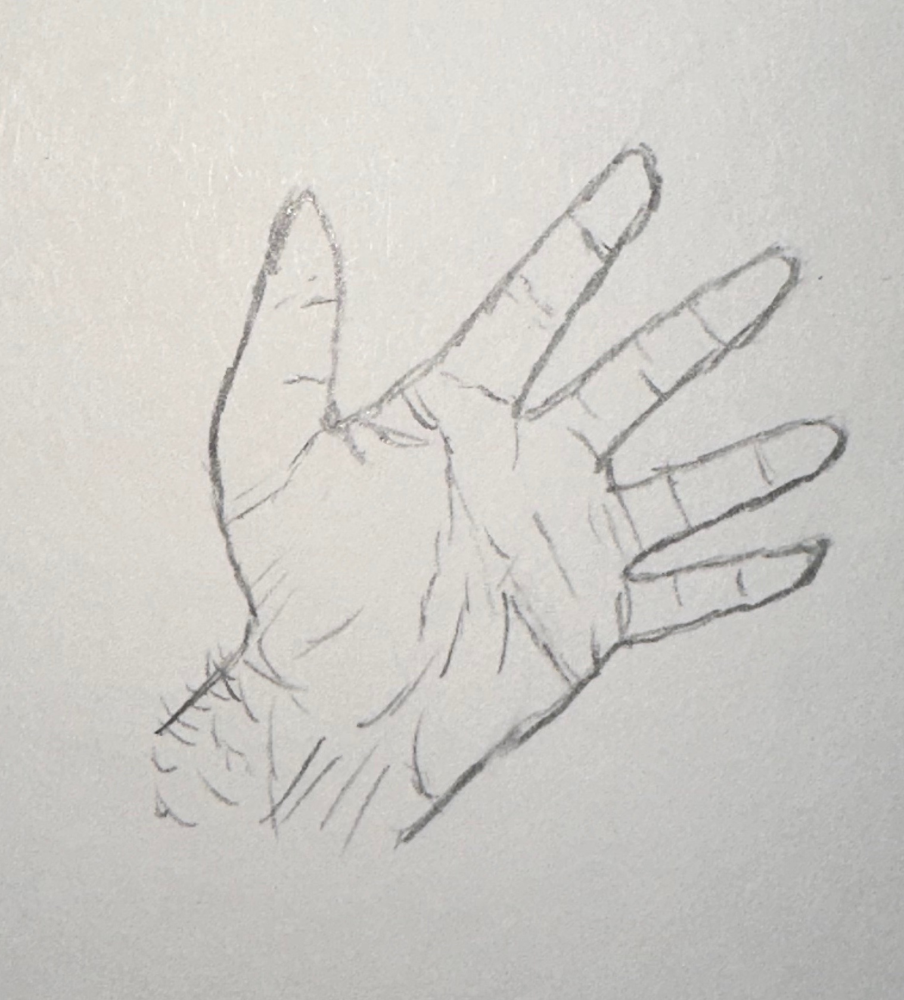
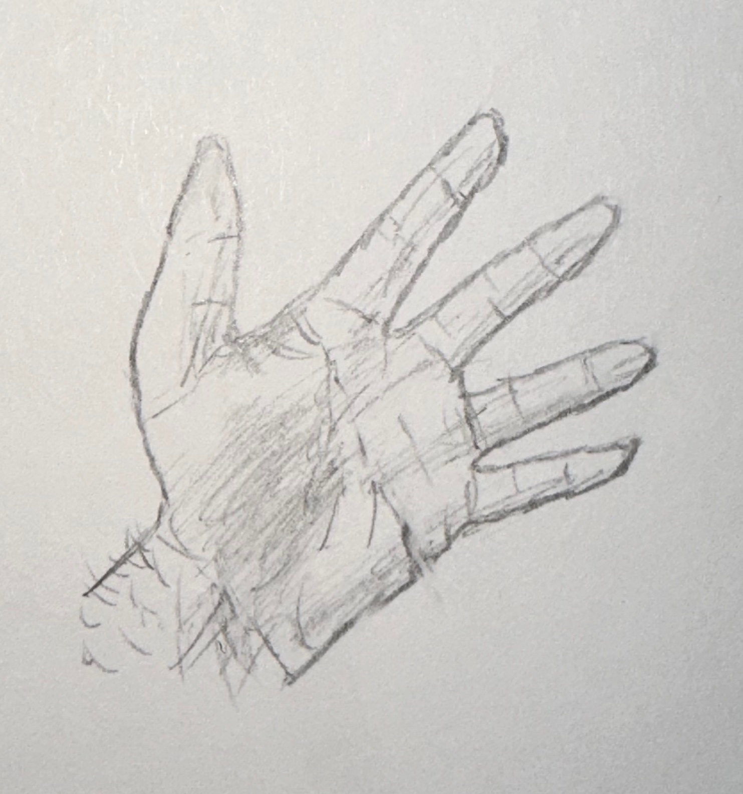

# Learnings from rediscovering drawing

Created: October 20, 2023 9:59 AM
Tags: Hobbies, Personal Dev

1. I’m a shit artist

As a child I would doodle on pretty much every surface I could get near which led to a number of developments including (1) banishment from the dining room (2) going to macaroni grill where drawing on the tablecloth was encouraged (!) (3) discovery of *paper* as a superior drawing medium. This continued for a number of years and I continued to love graffiti-ing surfaces until my mother decided to enroll me in a drawing class.

There is no better way to kill creative enthusiasm than to be thrown in a strictly structured environment where you are (a) forced to create exactly what your teacher (artist? professor? sensei?) wants and (b) asked to compare your shitty self-portrait to everyone else’s masterpiece in real time. So I drew no more, and the world weeped.

Last year I experimented with drawing for the first time since, remembering I actually used to enjoy it quite a bit. I drew what I wanted, when I wanted, and felt I learned a few things along the way. They follow:

### Really seeing what you look at

During my brief and ugly stint in drawing school we were asked to draw our own hands. It’s also something I ended up drawing several times because when you draw you tend to look at your hands. So you start, get a rough outline, throw up some guiding boxes and lines, and you end up with something like this:

Then you say hmm, well that still doesn’t look like a real hand. And taking a look at your hand you see it’s full of lines and creases. So you try to replicate that:

Then it still doesn’t look right so, like a nutcase, you comb your hands for hidden truths and discover you have depth to your hand where shadows gather and light plays over, so you try to replicate that too:

Looks more hand-esque. How did we get to this state? By paying closer and closer attention to our subject. Our brain filters information aggressively, it more or less only pays attention to novel information (1) and ignores the things it knows. Drawing something *********realistic********* requires deep attention to reality. It trains you to really see what you look at, not just scanning it at surface level. 

This is probably the skill I’ve benefit most from. Occasionally taking a step back and really looking at something gives the object depth I didn’t notice before. It gives me a greater appreciation for the world around me.

### You can be bad at something and still love it

As stated in point number 1, I am a shit artist. But I still draw despite this. I always assumed musicians, craftsmen, artists, all do what they do because they love what they produce. They have skill and because of that skill they enjoy their craft. Why continue something you do for fun if the end result looks like a dumpster fire? Isn’t that demoralizing?

I suppose I never judged myself for my drawing because I never took it seriously. It’s just scribbles on tree scraps. I also know I am drawing for myself alone. I have no intention of sharing the result with anyone. When there is neither internal nor external judgement, the work can turn out poorly and one may still be happy because they enjoyed the process. The result doesn’t matter.

### Focus need not be draining

Designing systems and writing code often requires this teeth-gritting concentration for hours at a time. You come out of this trance like a swimmer gasping for air and sort of look around the room half-remembering what you were doing before. I give this example because I do this day-to-day, but across many activities I’ve found this state of focus drains me. I need a cooldown period so my brain can go from floppy mush → useful tool.

I actually didn’t notice this when drawing though. I definitely could not (and don’t want to) draw for hours on end without breaks, but drawing precisely what you want requires deep focus to visualize the result and guide the pencil - and weirdly enough I emerge energized from this state of focus. I don’t know what is so different about this activity, but I imagine it has to do with producing something creative and there being zero expectations going into the activity. Creating things feels good, creating things for fun feels better.

### Cross Training

This is totally anecdotal evidence so take with a grain of salt, but I noticed my writing improving since picking up drawing again and I don’t think that’s a coincidence. In sports we have the idea of cross-training where swimmers also have dryland practice, muay thai fighters do a bit of jiujitsu, runners try some cycling. Performing an adjacent (or maybe not so adjacent) activity to a specialty strengthens the body in new ways and often improves performance in the main sport. We also know the same concept applies to the brain. Variety promotes better cognition, learning a new language makes your brain better at x or y or whatever. Creative pursuits likely have an outsize result on other creative pursuits by the same principle. The improvements I’ve been seeing make me eager to try something new.

(footnotes)

(1) This is a threat detection system wired into our brains from ye olde days. We’re constantly scanning the environment for danger, even if it’s not conscious.
